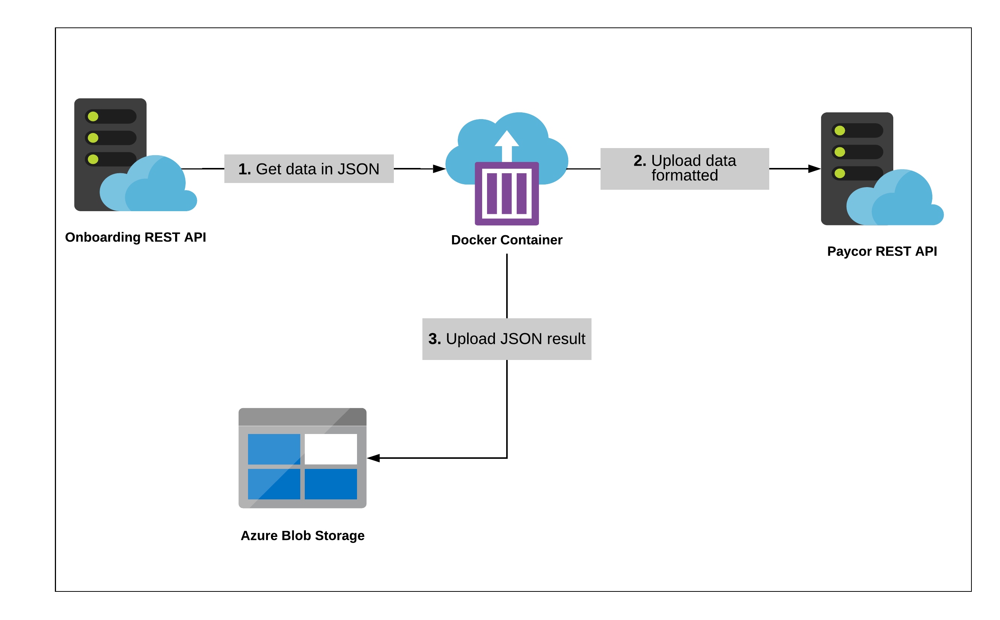

# Onboarding to Paycor - Intechideas
This project migrate data from Onboarding to Paycor.

## Environment Variables

Copy the `.env.example` file into `.env`. Fill the following variables:

### Parameters

| Option                                 | Description                                                    |
| -------------------------------------- | -------------------------------------------------------------- |
| CUSTOMER                               | Customer Name                                                  |
| DEBUG                                  | `1` for true DEBUG and `0` for false                           |
| FILE_ROOT_DIRECTORY                    | Name and path of the folder where the information is stored    |
| RESULT_JSON                            | Result `.json`                                                 |
| JSON_CONFIG                            | File name for configuration in .JSON Format                    |
| ENVIROMENT_MODE                        | `Development` or `Production`                                  |
| PROJECT                                | Project name                                                   |
| BIRDDOG_BASE_URL                       | Primary URL for BIRDDOG                                        |
| BIRDDOG_LOGIN_URL                      | Partial Login URL                                              |
| BIRDDOG_GET_EMPLOYEES_URL              | Partial URL of employees                                       |
| BIRDDOG_GET_DOCUMENTS_URL              | Partial URL of Documents                                       |
| BIRDDOG_PAYLOAD_APIKEY                 | BIRDDOG Credentials                                            |
| BIRDDOG_PAYLOAD_USERNAME               | BIRDDOG Credentials                                            |
| BIRDDOG_PAYLOAD_PASSWORD               | BIRDDOG Credentials                                            |
| BIRDDOG_COMPANY_CODE                   | BIRDDOG Company Code                                           |
| BIRDDOG_DOCUMENTS_DIRECTORY            | Name and path of the folder where the information is stored    |
| AZURE_ACCOUNT_CONN_STRING              | Blob storage connection string                                 |
| AZURE_BLOB_CONTAINER_PROJECT_NAME      | Blob storage container name                                    |
| AZURE_BLOB_CONTAINER_CLIENT_NAME       | Blob storage client name                                       |

## Diagram

## Run

* `./scripts/docker_run.sh`

## Build

* `./scripts/docker_build.sh`

## Pull

* `./scripts/docker_pull.sh`

## Push

* `./scripts/docker_push.sh`

## Clean

* `./scripts/clean.sh`